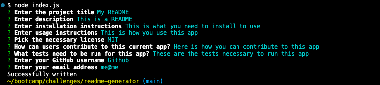

# <README Generator>

## Description

This app was made to facilitate the user in generating a README from a list of prompts. This generator can help decrease the time spent writing READMEs for users.

## Installation

To install this project, the user would need to first initalize the app in the command line using `npm init -y` and then install the dependencies using `npm i` in the command line. After running these commands the user should be able to utilize the app effectively.

## Usage

To use the app, you will run node index.js and type your answer for the prompts. For the checkbox you can use space to select the necessary item.

[gitHub-repo](https://github.com/lllewell/readme-generator)

[video](https://drive.google.com/file/d/1R3HYTRdbEdWQtDu9mZK5sRw90RA2ylY6/view?usp=sharing)